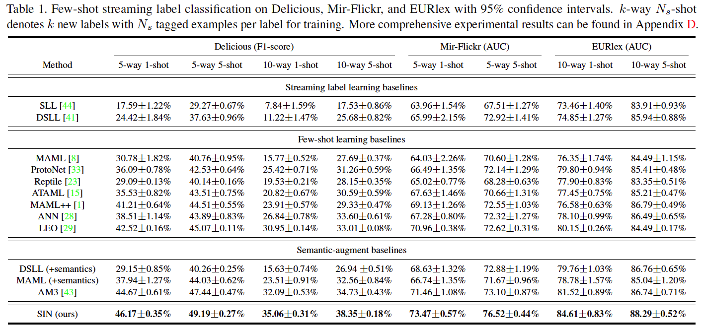
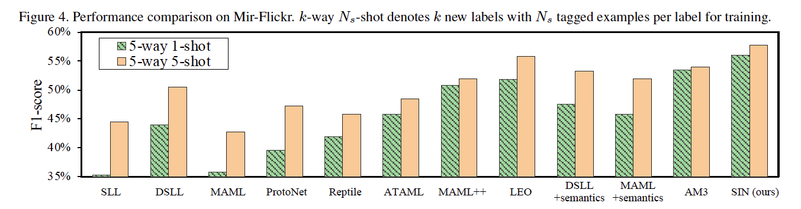

# SIN: Semantic Inference Network for Few-shot Streaming Label Learning

## 📋Dependence

Python 3.7

Pytorch 1.4

Torchvision 0.4

torchmeta 1.4.3

numpy 1.18.1

## 📋Running

Download datasets from 

http://manikvarma.org/downloads/XC/XMLRepository.html

http://mulan.sourceforge.net/datasets-mlc.html into the *datasets* folder.

To train the model in the paper, run this command:

```cd ./  ```  # open the folder where the code is located

```python meta-learner.py```  # run SIN model

> Load feature extractor. 
>
> Meta-trianing on Delicious.
>
> Evaluation after the last training epoch.

## 📋Results

The few-shot streaming label classification performance for SIN and other baselines are show in Table 1and Figure 4. We evaluate different number of new labels (-way) with number of examples (-shot) on Delicious and MIR-Flickr measured by Micro AUC and F1-score. 





- First, the results show that SIN significantly outperforms other methods and get the state-of-the-art performance on FSLL tasks. This indicates that the semantic knowledge and meta knowledge leveraged by SIN boost performance in few-shot streaming label learning very effectively.

- Second, traditional streaming label learning and few-shot learning baselines (e.g., DSLL and MAML) get a significant performance improvement when embedded semantic information, and AM3 also leverages the textual features to improve classification accuracy.
  However, these semantic-augment baselines ignore the correlation between past labels and new labels. 
- Third, it is worth noting that streaming label learning baselines perform worse than current few-shot learning baselines when examples are scarce, but they may recover quickly as examples increase. More detailed experimental results are given in the paper.
